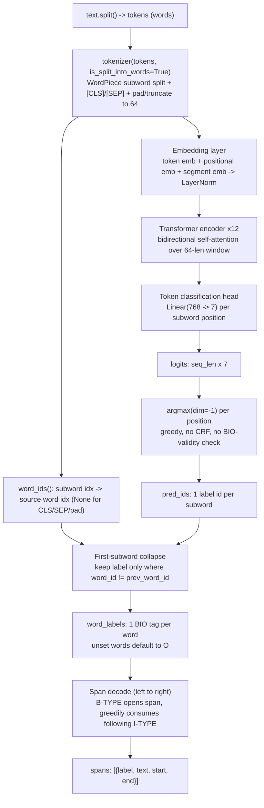

# Disfluency Node — Training Pipeline, Model Mechanics & Runtime Repair (Deep Dive)

File: `src/ordo_ai/nodes/disfluency.py`
Training sources: `notebooks/3.1_disfluency_bio_labeling.ipynb`, `notebooks/3.2_disfluency_bio_training.ipynb`
Label vocab: `data/disfluency/label_map.json`

## Position in pipeline

```
normalize.normalized_text → disfluency.run → repaired_text → ner / intent
                                            → disfluency_tags (debug/logging only)
```

Runs *after* normalize (punctuation stripped, numbers spelled out, lowercased), *before* NER and intent — downstream models only ever see `repaired_text`, never raw disfluent input.

## Tag taxonomy

| Tag | Name | Meaning | Span length | Example |
|---|---|---|---|---|
| `IP` | Interregnum/filler | standalone hesitation word | single token | `eh`, `anu`, `mmm`, `um`, `ee`, `em` |
| `FS` | False start | hyphen-truncated partial word + its completion | single token (the fragment) | `na- nasi` |
| `RC` | Repeat | exact adjacent word duplication | multi-token (`B-RC`/`I-RC`) | `sebentar sebentar` |
| `RP` | Reparandum | the wrong/replaced value in a self-correction | single token | `dua` in `dua, eh, tiga` |
| `RM` | Repair | the corrected value, paired with RP across a filler bridge | single token | `tiga` in `dua, eh, tiga` |
| `O` | Outside | fluent, kept as-is | — | everything else |

Label vocab is just 7 ids: `B-FS, B-IP, B-RC, B-RM, B-RP, I-RC, O`. `RC` is the *only* tag with an `I-` continuation variant — all others are single-token.

Notes from the labeling notebook:
- `RC` excludes vocatives/address terms (`kak`, `bang`, `mas`) so direct address isn't mistagged as a repeat disfluency.
- `RP`/`RM` pairing is restricted to **numeral-word swaps only** — the one pattern in the corpus where a bridging filler unambiguously signals a value correction rather than generic hesitation.
- `RP`, `RM`, `FS` are rare in the corpus (2-3 occurrences each total) — model is comparatively under-trained on these three.

---

## Part 1 — Training data origin

Source: `data/normalized/intent_dataset_normalized.jsonl`, **2,060 rows**.

Schema: `{"id": int, "text": str, "intent": str, "domain": str, "text_normalized": str}`.

Example: `{"id": 1, "text": "eh, gue mau pesen nasi goreng spesial dua porsi", "intent": "order_create", "domain": "restoran", "text_normalized": "eh gue mau pesen nasi goreng spesial dua porsi"}`.

Why this source: `text` retains disfluency markers (fillers, repeats, false starts, self-corrections), `text_normalized` only has punctuation stripped — **neither is BIO-labeled yet**. The 3.1 notebook's whole job is producing those labels. No separate cleaning pass — punctuation stripping happens inline per-token during labeling (`strip_punct`), not as a corpus pre-pass.

## Part 2 — Heuristic labeling pipeline (rule-based, not ML)

Constants (Cell 3):
- `FILLERS = {"eh","anu","um","hmm","ee","em"}`
- `BRIDGES = {"eh","anu"}` — subset of fillers eligible for RP/RM bridge detection
- `VOCATIVES = {"kak","bang","mas","bu","pak","mbak","lo","gue","bro","sis"}` — excluded from repeat-detection (so `"bang, bang"` isn't mistagged `RC`)
- `NUMERALS = {"satu",...,"sepuluh"}` plus `isdigit()` check

Functions, in call order via `full_label(text)`:

1. **`tokenize(text)`** — `text.split()`, whitespace only.
2. **`strip_punct(tok)`** — strips `,.;:!?` from edges. Produces `toks` (clean) alongside `raw_toks` (punctuation intact — needed because FS/bridge detection depends on trailing `-`/`,`).
3. **`label_core(toks, raw_toks)`** — single left-to-right pass, priority order per position:
   - **FS**: raw token ends in `-` (after stripping trailing comma) and next token's lowercase form starts with that prefix → `B-FS`. E.g. `na- nasi`.
   - **RC**: current and next lowercased tokens identical, non-empty, not a vocative → `B-RC`/`I-RC`, advance two tokens. E.g. `sebentar sebentar`.
   - **IP**: token in `FILLERS`, not a vocative → `B-IP`.
   - Else `O`.
4. **`apply_repair_bridges(toks, raw_toks, labels)`** — second pass, only touches tokens already `B-IP` and in `BRIDGES`. Checks comma-bridged pattern (`", <bridge>,"`) with a numeral immediately before and a *different* numeral immediately after. If matched: pre-bridge numeral → `B-RP`, post-bridge numeral → `B-RM` (only overwrites if currently `O`). E.g. `dua, eh, tiga` → `dua`=RP, `tiga`=RM.
5. **`validate_bio(toks, labels, record_id)`** — safety net: coerces any label outside `{"O","B-IP","B-FS","B-RC","I-RC","B-RP","B-RM"}` to `O`; coerces orphan `I-` tags (no matching preceding `B-`) to `B-`. Heuristics never actually produce orphans by construction — purely defensive.

**Corpus run result**: all 2,060 records labeled. Token-level tag counts: `B-IP=848, O=19588, B-RC=38, I-RC=38, B-RP=32, B-RM=32, B-FS=33`.

## Part 3 — Tokenization & label alignment

- Tokenizer target declared in 3.1: `LazarusNLP/NusaBERT-base` (exploratory choice for Javanese-accented Indonesian), `MAX_LENGTH=64`.
- `label2id = {'B-FS':0,'B-IP':1,'B-RC':2,'B-RM':3,'B-RP':4,'I-RC':5,'O':6}`.
- **`align_labels_with_tokens`**: tokenize with `is_split_into_words=True, truncation=True, max_length=64, padding="max_length"`. Walk `word_ids()`: special/pad tokens → `-100`; first subword of a word → `label2id[label]`; continuation subwords → `-100`. Standard "label first subword only, ignore rest via loss masking" convention. Result: 2,060/2,060 aligned, 0 mismatches.

## Part 4 — Stratified split (train/val/test)

- **`dominant_type(labels)`**: per record, picks rarest tag type present using fixed priority `["FS","RP","RM","RC","IP"]` (first match in that order wins), else `"fluent"`.
- Distribution: `fluent=1180, IP=777, RC=38, FS=33, RP=32`. **RM never appears as dominant** — every RM co-occurs with its paired RP, and RP outranks RM in priority, so RP always wins the dominant-type slot for those records.
- Split config: `SEED=42, VAL_FRAC=0.1, TEST_FRAC=0.1, MIN_STRATIFY_COUNT=4`. Two sequential stratified splits (80/20 then the 20% split again 50/50) — `sklearn.train_test_split` requires ≥2 members per class per split, so a class needs ≥4 total to survive both splits.
- Records whose dominant type has global count `< 4` (i.e. `FS`, `RP` since their counts are below threshold in this counting scheme) are force-assigned entirely to **train**, bypassing stratification. Remaining types (`fluent`, `IP`, `RC`, all ≥4) stratify normally via two `train_test_split` calls.
- Result: **train=1648, val=206, test=206** rows.

## Part 5 — Labeled output files

- Directory: `data/disfluency/`.
- `train.jsonl` (1,648 rows), `val.jsonl` (206), `test.jsonl` (206), `label_map.json`.
- Row schema: `{"id": int, "intent": str, "input_ids": [64 ints], "attention_mask": [64 ints], "labels": [64 ints, -100 for ignored positions]}`.
- Note: raw `text`/word-level `tokens`/`labels` are **not** persisted — only pre-tokenized tensors + id/intent survive into the split files.

## Part 6 — Model training (`3.2_disfluency_bio_training.ipynb`)

**Base model**: `indobenchmark/indobert-base-p1` (deviates from 3.1's exploratory `NusaBERT-base` mention — actual training uses indobert-base-p1). Loaded via `AutoModelForTokenClassification`, `num_labels=7`. Pooler dropped (unexpected), classifier head freshly initialized (missing) — expected for adapting a base encoder to token classification. **123,856,135 params, all trainable** (full fine-tune). Device: `mps` (Apple Silicon) on this run.

**Tokenizer**: reuses 3.1's pre-aligned `max_length=64` tensors directly — no re-tokenization during training.

**Class imbalance handling** — critical given `O` is ~93% of train tokens:
- Train-only counts: `B-FS=26, B-IP=680, B-RC=30, B-RM=26, B-RP=26, I-RC=30, O=15651`.
- Inverse-frequency weights: `weight[i] = total_tokens / (n_classes * max(count[i], 1))` → `B-FS=90.49, B-IP=3.46, B-RC=78.42, B-RM=90.49, B-RP=90.49, I-RC=78.42, O=0.15`.
- **`WeightedTrainer`** subclasses HF `Trainer`, overrides `compute_loss` to use `CrossEntropyLoss(weight=class_weights, ignore_index=-100)` instead of default unweighted loss. Mirrors the approach used in `4.2_ner_training.ipynb`, applied here because disfluency imbalance is even sharper.

**Hyperparameters** (`TrainingArguments`):
| Param | Value |
|---|---|
| epochs | 5 |
| batch size (train/eval) | 16 / 16 |
| learning rate | 2e-5 |
| lr scheduler | linear, warmup_ratio=0.1 |
| weight decay | 0.01 |
| eval/save strategy | per epoch, `save_total_limit=2` |
| best model selection | `metric_for_best_model="f1"`, `load_best_model_at_end=True` |
| seed | 42 |

**Training result**: `train_loss=0.18764`, `train_runtime=314.82s`, `epoch=5.0`, ~26 samples/sec.

## Part 7 — Evaluation output (seqeval, test split)

Overall: **precision=recall=f1=0.9897**, accuracy=0.99951, test_loss=0.03174.

Per-tag (entity-level):
| Tag | Precision | Recall | F1 | n (test) |
|---|---|---|---|---|
| FS | 1.000 | 1.000 | 1.000 | 4 |
| IP | 1.000 | 1.000 | 1.000 | 83 |
| RC | 0.750 | 0.750 | 0.750 | 4 |
| RM | 1.000 | 1.000 | 1.000 | 3 |
| RP | 1.000 | 1.000 | 1.000 | 3 |

Notable: despite being the rarest tags in training data, `FS`/`RP`/`RM` hit perfect F1 on their (small, n=3-4) test slices. The only imperfect tag is `RC` (one of four mismatched) — somewhat counterintuitive since `RC` had more train examples (30) than `RP`/`RM`/`FS` (26 each).

## Part 8 — Final artifact & runtime wiring

- Saved via `trainer.save_model("../models/indobert-disfluency-bio-final")` + explicit tokenizer save alongside.
- Resolves to `models/indobert-disfluency-bio-final` from repo root — **exact match** to `settings.disfluency_model_path` in `src/ordo_ai/config.py`, which `nodes/disfluency.py`'s `_load()` reads at runtime.
- `id2label` round-trip confirmed on reload: `{0:'B-FS',1:'B-IP',2:'B-RC',3:'B-RM',4:'B-RP',5:'I-RC',6:'O'}`.

---

## How IndoBERT predicts token-level labels

`AutoModelForTokenClassification.from_pretrained(...)` wraps base IndoBERT (BERT-style transformer encoder) with one extra layer: a linear classifier head (`hidden_size=768 → num_labels=7`) on top of every token's final hidden state. There is no decoder, no CRF, no sequence-level pooling for this task — every subword position gets its own independent 7-way classification.



Low-level walk of the diagram:

- **A→B**: word-level tokens enter WordPiece; one word can yield N subwords.
- **B→C / B→D**: `word_ids()` is pure bookkeeping (no learned weights) — runs in parallel to the actual embedding path so collapse step later knows which subword is "first" per word.
- **D→E→F→G**: the only learned-weight path; 12 self-attention layers give every subword full bidirectional context before the final per-position `Linear(768,7)` projects to label space.
- **G→H→I**: decision step is pure `argmax`, independent per position — no transition constraints between adjacent tags (this is the source of the orphan `I-RC` edge case below).
- **C + I → J→K**: collapse merges the bookkeeping array with predictions — only first-subword-of-word predictions survive, rest discarded. Mirrors training-time `-100` masking exactly.
- **K→L→M**: span decode is a second pure-logic pass (no model involved), walks word-level BIO greedily extending `I-` runs.

Forward pass, mapped to `predict_disfluency`'s `model(**encoding).logits`:

1. **Input construction**: `tokenizer(tokens, is_split_into_words=True, ...)` runs WordPiece subword tokenization per word, then wraps the sequence with `[CLS] ... [SEP]` and pads/truncates to `max_seq_length` (64, matching training). `word_ids()` is the bookkeeping array that maps each subword position back to its source word (or `None` for `[CLS]`/`[SEP]`/padding) — this is what makes "label the first subword, ignore the rest" possible on both the training (loss masking with `-100`) and inference (collapse step) sides.
2. **Embedding**: each subword id → its token embedding, plus a learned positional embedding and (BERT-standard) segment/type embedding, summed and layer-normed. This is the only place subword identity enters the model — everything after is contextual.
3. **Transformer encoder stack**: 12 self-attention layers (IndoBERT-base config) let every position attend to every other position in the 64-length window. This is *why* a filler like `eh` sandwiched between a wrong numeral (`dua`) and corrected numeral (`tiga`) can be tagged `B-IP` while the numerals themselves get `B-RP`/`B-RM` — the model has bidirectional context to recognize the comma-bridged correction pattern, not just a fixed local window like the heuristic labeler's regex-style rules.
4. **Token classification head**: final hidden state per position (`seq_len × 768`) passes through one `Linear(768, 7)` layer → raw logits per position, one 7-vector per subword token (including `[CLS]`/`[SEP]`/padding positions, which get logits too but are never read).
5. **Label decision**: `logits.argmax(dim=-1)` per position picks the highest-scoring of the 7 label ids — pure greedy decoding, no beam search, no CRF transition constraints between adjacent tags. This means the model could in principle predict an `I-RC` with no preceding `B-RC` (an invalid BIO sequence) — nothing in the architecture enforces tag-transition validity; `validate_bio` only runs at training-label-construction time, not at inference time. (Production gap documented in the edge case below.)
6. **First-subword collapse**: `predict_disfluency` then walks `word_ids()` and keeps only the prediction at each word's *first* subword token (`word_id != prev_word_id`), discarding predictions made on later subwords of the same word. This exactly mirrors how `align_labels_with_tokens` assigned the gold label only to the first subword during training (`-100` elsewhere) — train/inference labeling convention is symmetric by construction.
7. **Span decode**: word-level BIO tags are walked left-to-right; a `B-{TYPE}` opens a span that greedily consumes immediately-following `I-{TYPE}` words of the same type (only `RC` has `I-` tags, so this loop only ever extends spans for repeats).

Why weighted loss matters for what the model actually learns: with `O` at ~93% of train tokens, unweighted cross-entropy would let the model minimize loss by defaulting toward `O` and barely learning the rare classes. `WeightedTrainer`'s inverse-frequency weights (`O=0.15` vs `B-FS=90.49`) rescale the per-token loss contribution so a missed `B-FS`/`B-RP`/`B-RM` is penalized ~600x harder than a missed `O` — this is the mechanism behind the rare tags (2-3 corpus occurrences) still reaching perfect test F1 despite minimal data.

### `predict_disfluency(text)` — code reference

```python
tokens = text.split()
encoding = tokenizer(tokens, is_split_into_words=True, ...)
word_ids = encoding.word_ids()
logits = model(**encoding).logits[0]
pred_ids = logits.argmax(dim=-1).tolist()
```

Subword → word collapse:

```python
word_labels = [None] * len(tokens)
prev_word_id = None
for tok_idx, word_id in enumerate(word_ids):
    if word_id is not None and word_id != prev_word_id:
        word_labels[word_id] = id2label[pred_ids[tok_idx]]
    prev_word_id = word_id
word_labels = [lbl if lbl is not None else "O" for lbl in word_labels]
```

- A word that splits into multiple subwords (common for Indonesian colloquialisms/slang) gets **only its first subword's prediction**.
- Special tokens (`word_id is None`) never assign a label.
- Any word that somehow ends up unset (shouldn't normally happen, but defensive) defaults to `"O"`.

BIO → span decode:

```python
i = 0
while i < len(tokens):
    lbl = word_labels[i]
    if lbl.startswith("B-"):
        span_type = lbl[2:]
        j = i + 1
        while j < len(tokens) and word_labels[j] == f"I-{span_type}":
            j += 1
        spans.append({"label": span_type, "text": " ".join(tokens[i:j]), "start": i, "end": j})
        i = j
    else:
        i += 1
```

- `O` and any orphan `I-` tag without a preceding `B-` are skipped, advancing one word at a time.
- Span dict uses **word indices**, `end` exclusive — e.g. `sebentar sebentar` at positions 7-8 → `{"label": "RC", "text": "sebentar sebentar", "start": 7, "end": 9}`.

Output: `{"tokens": [...], "labels": [...per-word BIO...], "spans": [...decoded spans...]}`.

## `repair(text)` — span → repaired string

```python
DELETE_TAGS = {"IP", "RP", "FS"}

result = predict_disfluency(text)
drop_indices = set()
for span in spans:
    if span["label"] in DELETE_TAGS:
        drop_indices.update(range(span["start"], span["end"]))
    elif span["label"] == "RC":
        drop_indices.update(range(span["start"], span["end"] - 1))
kept = [tok for idx, tok in enumerate(tokens) if idx not in drop_indices]
return " ".join(kept)
```

Per-span handling:

| Tag | Action | Why |
|---|---|---|
| `IP` | drop entire span | filler carries no semantic content |
| `RP` | drop entire span | it's the *wrong* value — superseded by the paired `RM` |
| `FS` | drop entire span | truncated fragment, completion word right after carries the meaning |
| `RC` | drop all but the **last** word (`end - 1` excluded from drop) | repeated word collapses to one fluent occurrence |
| `RM` | **not in any branch — untouched** | it's the *correct* corrected value, must survive |
| `O` | not a span, never touched | already fluent |

Final repaired string = remaining tokens rejoined with single spaces, in original order (drop is index-based, not reconstruction, so order is preserved).

## Worked examples (from `data/raw/intent_dataset_complex_disfluency.jsonl`)

### Example 1 — multiple IP fillers
```
input:  "eh gue mau pesen, anu, nasi goreng spesial dua porsi sama ayam bakar, eh, satu aja deh, sama es teh manis tiga gelas"
```
(after normalize strips commas) tags: `eh`→`B-IP`, `anu`→`B-IP`, second `eh`→`B-IP`, rest `O`.
repaired ≈ `"gue mau pesen nasi goreng spesial dua porsi sama ayam bakar satu aja deh sama es teh manis tiga gelas"`
— three filler spans dropped, dish/quantity words all kept intact for NER.

### Example 2 — IP fillers, no false starts or repeats
```
input: "kak mau order, mmm, mie ayam yang dua porsi itu, eh sama pangsit goreng, terus, anu, jus alpukat satu gelas gede"
```
`mmm`, `eh`, `anu` each tagged `B-IP`, dropped. Note `kak` (vocative) correctly stays `O` — not mistaken for anything.

### Example 4 — RP/RM numeral correction pattern
```
input: "eh tambah lagi deh, gado-gado satu sama, mmm, es jeruknya jadi dua gelas aja, eh tiga deh biar pas"
```
- Leading `eh` → `B-IP`, dropped.
- `mmm` → `B-IP`, dropped.
- `dua ... eh tiga` is the RP/RM bridge pattern: `dua`→`B-RP` (dropped, wrong quantity), `eh`→`B-IP` (dropped), `tiga`→`B-RM` (**kept** — corrected quantity).
- Result: cart-relevant quantity resolves to `tiga`, not `dua` — critical for order_agent correctness downstream.

## Known edge case (from training notebook's own inference demo, Cell 23-27)

Sentence `"mas, gue mau, mau pesen ayam goreng satu porsi"` — expected `mau, mau` → `B-RC`/`I-RC`. Actual: span list came back **empty** (`spans: []`), only a bare `I-RC` visible with no preceding `B-RC`, so `repair()` left both `mau` occurrences untouched. Likely cause: the comma directly attached to the first `mau` (`mau,`) interacts differently with repeat-detection at inference time (word-split on raw text) vs. training-time labeling (which used the punctuation-stripped `toks` array, not `raw_toks`, for the RC check). This is also a direct example of the argmax-only decoding gap noted above — no BIO-validity constraint at inference time let an orphan `I-RC` through. Worth a regression test if comma-adjacent repeats show up in production transcripts.

## Why this matters downstream

`repaired_text` (not `normalized_text`) feeds both `ner.run` and `intent.run`. If disfluency repair mislabels an `RM` as `RP` (or vice versa) on a numeral pair, the wrong quantity reaches NER and the cart gets the wrong count — given `RP`/`RM` is the rarest, least-trained tag pair (2-3 corpus examples), this is the most fragile part of the node in production.
