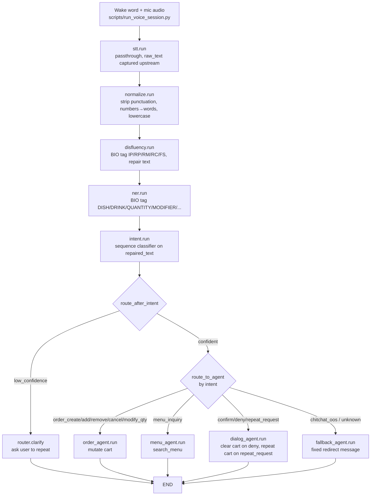

# Ordo-AI Pipeline: Input → Output

End-to-end flow of one voice utterance through the LangGraph pipeline, from raw mic audio to a spoken/text agent response.

## Flowchart



## Stage-by-stage

### 0. Audio capture — `scripts/run_voice_session.py` / `nodes/stt.py`
- Mic idle until wake word fires (`hey_jarvis` via openWakeWord), then `RealtimeSTT` transcribes one utterance.
- Graph invoked **per utterance** — `stt.run` is a pure passthrough: `raw_text` already in state when graph starts.
- State in: `raw_text` (set upstream). State out: `raw_text` (unchanged).

### 1. Normalize — `nodes/normalize.py`
- `remove_punctuation`: regex strip non-word/space chars.
- `normalize_numbers`: digits → Indonesian words (`num2words(lang="id")`), e.g. `9` → `sembilan`.
- Collapse whitespace, lowercase.
- In: `raw_text`. Out: `normalized_text`.

### 2. Disfluency repair — `nodes/disfluency.py`
- Fine-tuned token classifier tags each word BIO-style: `IP` (filler: eh/anu/um), `FS` (false start: `na- nasi`), `RC` (repeat: `mau, mau`), `RP`/`RM` (reparandum/repair pair across numeral self-corrections: `dua, eh, tiga`).
- `repair()`: deletes `IP`/`RP`/`FS` spans entirely, collapses `RC` to last occurrence, keeps `RM` (the corrected value) untouched.
- In: `normalized_text`. Out: `disfluency_tags`, `repaired_text`.

### 3. NER — `nodes/ner.py`
- Same BIO subword→word→span decode pattern as disfluency, separate fine-tuned model/label set (menu entities: DISH, DRINK, QUANTITY, MODIFIER, ADD_ON, SIZE, REMOVE, etc.).
- In: `repaired_text`. Out: `entities` (list of `{text, label, start, end}`).

### 4. Intent classification — `nodes/intent.py`
- Sequence classifier (not token-level) over `repaired_text` → single intent label + softmax confidence + full prob dist.
- In: `repaired_text`. Out: `intent`, `intent_confidence`, `intent_probs`.

### 5. Routing — `nodes/router.py`
- `route_on_confidence`: `intent_confidence` below `settings.intent_confidence_threshold` → `"low_confidence"` branch → `clarify` node (asks user to repeat, sets `needs_clarification`/`clarification_message`), graph ends.
- Otherwise `route_to_agent`: static `intent → agent` map:
  - `order_create/add_item/remove_item/cancel/modify_quantity` → **order_agent**
  - `menu_inquiry` → **menu_agent**
  - `confirm/deny/repeat_request` → **dialog_agent**
  - anything else (`chitchat_oos`, unmapped) → **fallback_agent**

### 6. Agent execution (terminal node, graph ends after)
- **order_agent**: groups `entities` (DISH/DRINK/REMOVE anchors + nearby QUANTITY/MODIFIER/ADD_ON/SIZE) via `_group_entities`, resolves against menu (`find_menu_item`), mutates `cart` (add/increment/change qty/remove/clear-on-cancel). Out: `cart`, `agent_response`.
- **menu_agent**: takes first DISH/DRINK entity as query, `search_menu`, lists matches + prices, or not-found message. Out: `agent_response`.
- **dialog_agent**: `confirm` → ack; `deny` → clears `cart`; `repeat_request` → reads back current `cart` contents. Out: `agent_response` (+ `cart` on deny).
- **fallback_agent**: ignores entities/cart, fixed redirect string. Out: `agent_response`.

## State shape (`OrderState`, partial dict)

| Field | Set by | Type |
|---|---|---|
| `raw_text` | upstream mic loop | str |
| `normalized_text` | normalize | str |
| `disfluency_tags` | disfluency | list[str] |
| `repaired_text` | disfluency | str |
| `entities` | ner | list[EntitySpan] |
| `intent`, `intent_confidence`, `intent_probs` | intent | str, float, dict |
| `needs_clarification`, `clarification_message` | router.clarify | bool, str |
| `cart` | order_agent / dialog_agent | list[CartItem] |
| `agent_response` | any terminal agent | str |

`EntitySpan = {text, label, start, end}`, `CartItem = {menu_id, name, price, quantity, notes}`.

## Worked example

Input (`restaurant_conversations_dataset.jsonl` row 5):
```
"Tolong dibuatkan sembilan mie kuah ini panas amat, sebentar sebentar eh, tahu goreng ada nggak ya"
```

1. **normalize** → lowercase, no punctuation change (already clean), numbers already words here.
2. **disfluency** → `sebentar sebentar` tagged `B-RC I-RC` → collapsed to one `sebentar`; `eh` tagged `B-IP` → dropped. `repaired_text` ≈ `"tolong dibuatkan sembilan mie kuah ini panas amat sebentar tahu goreng ada nggak ya"`.
3. **ner** → `sembilan`=QUANTITY, `mie kuah`=DISH, `tahu goreng`=DISH (second dish mention).
4. **intent** → `order_create` (matches dataset label), high confidence.
5. **router** → confident → `order_agent`.
6. **order_agent** → groups QUANTITY(sembilan)+DISH(mie kuah) as one cart line, second DISH(tahu goreng) with no quantity defaults to 1; both added to `cart`; `agent_response` confirms order.
